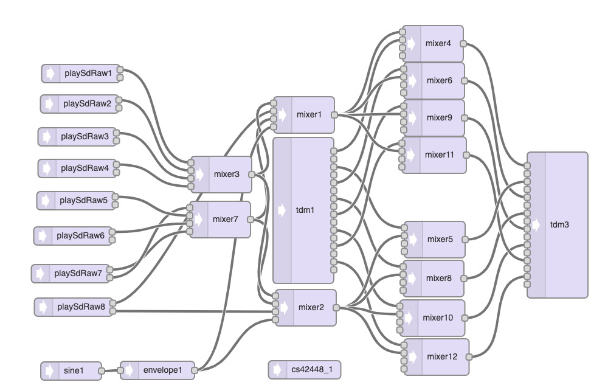

# teensyquencer
A loop pattern sequencer for teensy
* setting next pattern will take effect once current pattern is complete.
* using akai apc40 controller to select patterns for channels
* comming soon - star this repo if you want to see these features
  * midi import and export
  * playing samples at different pitches
  * parameter, midi, audio recording and playback
 


[](https://www.youtube.com/watch?v=eEeuXfxMdCI)

## code
* define multisequencer:
``` c
tempo tempo(120.0f);
multisequencer multisequencer(tempo);
```

* add sequencer channel:
``` c
  sequencer *sequencer = multisequencer.newSequencer();
```

* add event callbacks:
``` c
  sequencer->onevent = [] (sequencerevent *event) {
      switch(event->channel) {
        case 0: triggerAudioEvent(event, playSdRaw1, "KICK.WAV"); break;
        case 1: triggerAudioEvent(event, playSdRaw2, "SNARE.WAV"); break;      
        default: break;
      }
  };
```
* add pattern:
``` c

  //                        !               !               !               !      
  const char* pattern4x4 = "X...X...X...X...X...X...X...X...X...X...X...X...X...X...X...X..."; 
  const char* patternSnr = "....x.......x.......x.......x.......x.......x.......x.......x..."; 

  int pattern = sequencer->addPattern(4); // empty pattern: 4 bars;
  pattern = sequencer->addPattern(4); // kick solo 4 x 4: 4 bars
  readPattern(0, pattern, pattern4x4, sequencer); //kick

  pattern = sequencer->addPattern(4); // kick solo 4 x 4 + snare: 4 bars;
  readPattern(0, pattern, pattern4x4, sequencer); //kick
  readPattern(1, pattern, patternSnr, sequencer); //snare
```

## compiling for teensy
You will need to add c++ std library to your compiler flags in boards.txt (Teensyduino/Java/hardware/teensy/avr/boards.txt)
* remove -nostdlib from teensy40.build.flags.common
* add -lstdc++ to teensy40.build.flags.cpp
```
teensy40.build.flags.common=-g -Wall -ffunction-sections -fdata-sections
teensy40.build.flags.cpp=-std=gnu++14 -fno-exceptions -fpermissive -fno-rtti -fno-threadsafe-statics -felide-constructors -Wno-error=narrowing -lstdc++
```

